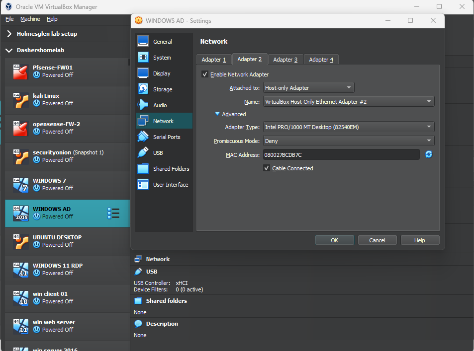
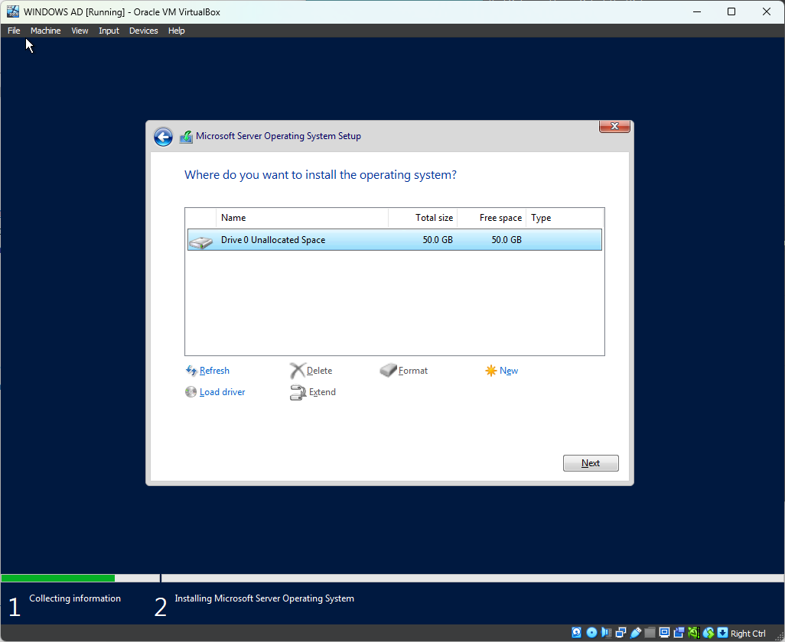
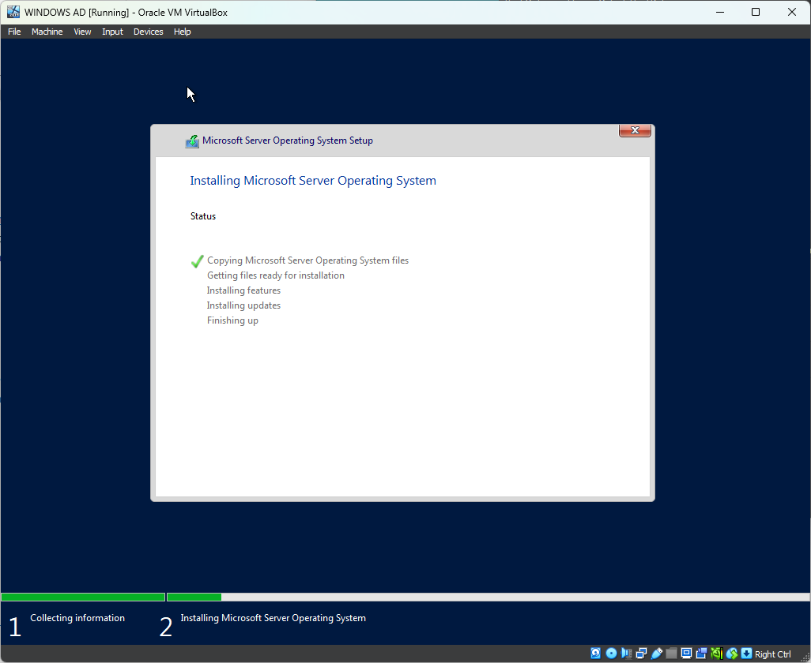
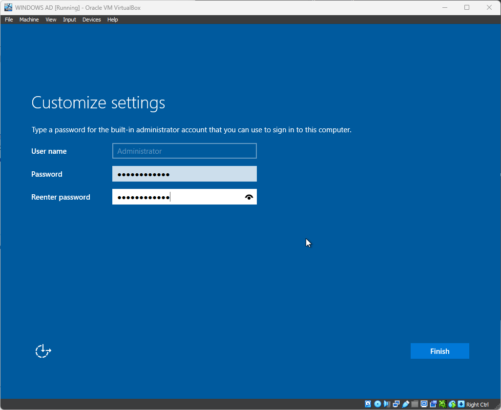
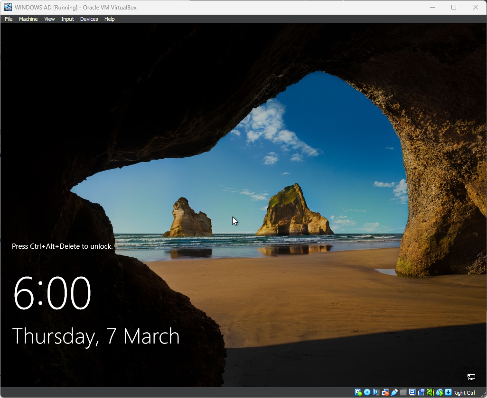
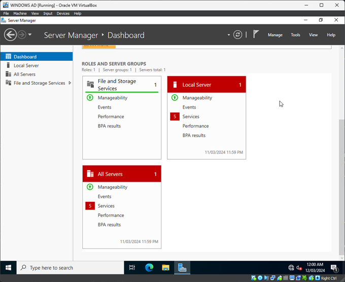
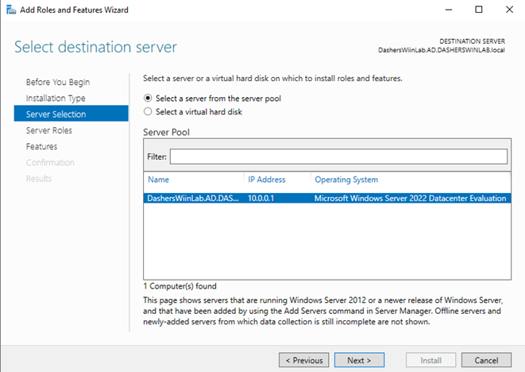

# ACTIVE DIRECTORY SETUP ON WINDOWS SERVER 2022

- Create a Windows Server 2022 VM in VirtualBox.
- Configure VM with minimum requirements due to limited resources.
- Set up two NICs:
  - One with NAT for external access.
 
 

- Another with Host-only adapter for host-only access.

 

  
- VM traffic is routed through a pfSense firewall.
- Start the VM and follow standard Windows installation instructions.

 

 

- Choose "Windows Server 2022 Datacenter Evaluation (Desktop Experience)" for lab.

 

 

 

- Complete installation, set password for built-in admin when prompted.

 

- Press ` CTRL + ALT + DEL ` to login to the server.

 

- Login using username `Administrator` and the provided password.

 

- Server Manager starts automatically on startup.

 

- In Server Manager the default services are visible.

 

- Rename the PC to a sensible name (e.g., `DASHERSLAB AD`).

 

- Restart the PC after renaming.
- Begin installing Active Directory services:

 

  - Click on "Roles and Features".
  - Select installation type as "Roles and Features".

 

  - Select the server displayed (if only one).

 

  - Choose "Active Directory Domain Services" as the server role.
  - Click "Add Features" and then "Next".

 

  - Check "Restart if required" on the confirmation screen.
  - Click "Install" to install the role.
- After installation, a notification prompts for post-deployment configuration to promote this server to a Domain Controller.
- Start the deployment configuration wizard:
  - Choose "Add a new Forest".
  - Provide a domain name.
  - Configure optional restore password.
  - Leave DNS options at default.
  - NetBIOS domain name is auto-populated from forest name.
  - Directory paths can be left as default.
  - Review changes; opt for manual installation (not PowerShell script).
  - Click "Next" and proceed with prerequisite checks (ignore if needed).
  - Click "Install" to begin installation.
- Restart the PC once installation is complete; login screen displays domain name.
- Login to the newly created domain, not the local PC.
- Server Manager shows AD DS server group running.
- Now its a good practice to create a local Admin other than the built in Administrator.
- You can create this Admin and contain user in a Organizational unit.
- You can view the process in detail here https://github.com/rajeevlraman/ActiveDirectory/blob/main/README.md
- After creating the user you can login with the new Admin.
- Now that we have the Active Directory setup, the DNS `DOMAIN NAME SYSTEM ` service is automatically configured.
- AD DS relies heavily on DNS for name resolution within the domain.
- DNS facilitates locating other domain controllers, domain-joined computers, and other domain resources.
- Of course it can be tweaked according to requirements, but the integration of these services ensures the seamless functioning.
