# ActiveDirectory
  We wil see how to add a CA ` CERTIFICATE AUTHORITY ` role and a Local Admin group with a Admin user
## 1. Enabling Certificate Authority CA in Active Directory 

<!--
CA roles and features
-->
## We need to Add Certificate Authority (CA) Roles in Active Directory. 
The CA roles are needed to satisfy and perform various functions in the domain. 
The following are when we need the CA roles:
<table>  
 <td>

 ***Issuing Certificates:***
   - CA roles are needed to issue digital certificates for users, computers, devices, and services within your domain or organization.
 
 </td> 
 </table>

 <table>  
 <td>
    
***PKI (Public Key Infrastructure) Deployment:***
   - Deploying a PKI infrastructure requires CA roles to manage certificates centrally, including issuance, management, and revocation.
 
 </td> 
 </table>

<table>  
 <td>
    
***Secure Authentication:***
   - Enable secure authentication mechanisms like smart card logon, VPN authentication, and wireless network authentication, which rely on certificates.
 
 </td> 
 </table>

<table>  
 <td>
    
 ***Compliance and Regulatory Requirements:***
   - Ensure compliance with regulations (e.g., GDPR, HIPAA) that mandate certificate use for encryption and data protection.
 
 </td> 
 </table>

 <table>  
 <td>
    
 ***Internal Application Requirements:***
   - Some applications or services require certificates for secure communication or encryption, facilitated by CA roles.
 
 </td> 
 </table>

<table>  
 <td> 
    
***Trust and Authorization:***
   - Establish trust relationships within your organization and with external entities using certificates issued by a trusted CA.
 
 </td> 
 </table>

### Summary

Adding Certificate Authority (CA) roles in Active Directory is crucial for establishing a secure, centralized infrastructure to issue and manage digital certificates. This supports secure communications, authentication mechanisms, regulatory compliance, application requirements, and trust relationships.

<!-- end CA role -->

## Now lets see how we can add the CA services.

- On the service manager dashboard click on Roles and Features.
- select the roles and feature option.
- since I have only one domain it will be displayed so select it.
- In the Server Roles select &#x2611; Active Directory Certificate Services

  
<!-- to add check box
- [ ] Task 1
- [x] Task 2 (completed)
- [ ] Task 3
- Another example: Complete the task &#x2611; by Friday.
&cross;
&#x2610;
&check;
&#x2612;
https://www.toptal.com/designers/htmlarrows/symbols/script-capital-r/
-->

- Click Next till you reach the Role Services and then  &#x2611; Certification Authority

 

- Click next and check &#x2611; the restart Automatically if required check box
- click yes on the popup message confirmaing auto restart.

 

- click on the install button and complete the installation.
- In the results you can see it mentions ` configuration required`

 

- In the notification area click on the Configure Active Directory Certificate Services.

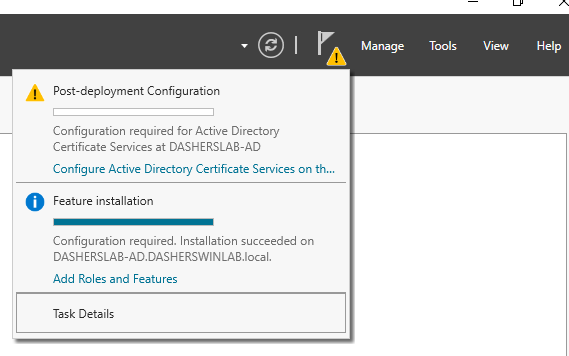 

- The Configuration wizard for CA services Starts.
- We need to Specify credentials to configure the CA role services.
- The Domain Administrator is entered in the Credentials textbox ` DASHERSWINLAB\Administrator `

 

- In the Select Roles and Services check &#x2611; Certification Authoritry

 

- In the Setup type we choose the option Enterprise CA

 

- In the CA Type we can choos the Root CA option

 

- For the Private Key specification we choose the option Create a New private Key.

 

   - for the Private key we need to set the Encryption parametres.
   - Cryptographic provider we choose `RSA#Microsoft Software Key Storage Provider`
   - Key Length ` 2048 `
   - Hash Algorith for signing Certificates we choose ` SHA 256 `
   - 

 

   - We need to Specify the Name of the CA
   - I chose to add DOmain name - pcname -CA so ` DASHERSWINLAB-DASHERLAB-AD-CA `
   - i choose the defaults provided in the Distinguished name.

 

   - For Validity period i just chose 99 years.

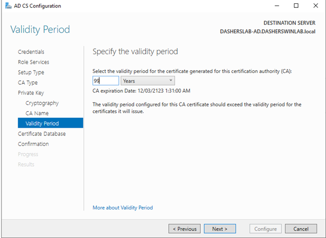 

- Choose the Database Locations. i chose he default.

 

- review and confirm the configuration values and click on configure button.

 

the configurationo will be confirmed and you can view the detials by clicking on the link provided.

 

# 2. Creating an Organizational Unit (OU): 

1. **Open Active Directory Users and Computers**:
   - Go to **Start Menu** → **Administrative Tools** → **Active Directory Users and Computers**.

2. **Navigate to the Domain**:
   - Expand the domain node where you want to create the OU (e.g., `AD.DASHERSWINLAB.local`).

3. **Create the OU**:
   - Right-click on the domain or an existing OU where you want to create the new OU.
   - Select **New** → **Organizational Unit**.
   - Name the new OU following a clear naming convention. For example, if creating an OU for Admin Users, you might name it `AdminUsers`. i have named it `LabAdmins`.

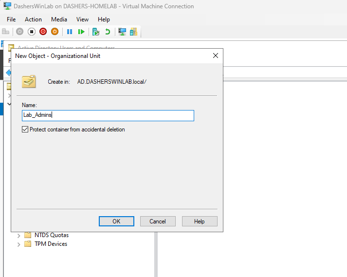 

4. **Set Permissions (Optional)**:
   - Right-click on the new OU (`LabAdmins`) → **Properties**.
   - Go to the **Security** tab to set permissions for who can manage objects within this OU.
   - I'll leave it empty.

### Creating an Admin User in the OU:

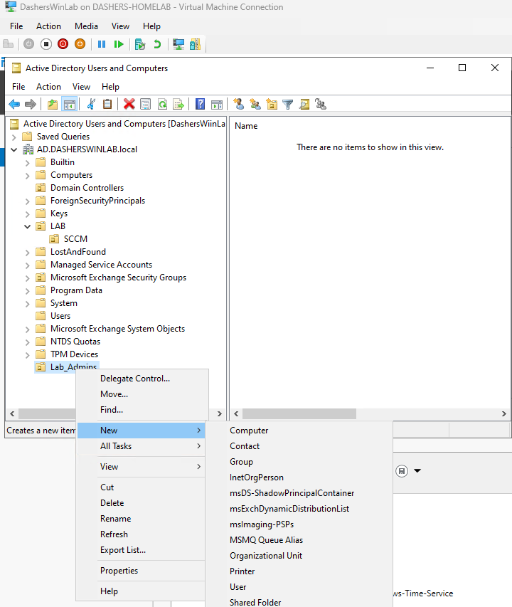 

1. **Create the User Account**:
   - Right-click on the newly created OU (`LabAdmins`) or any other suitable OU.
   - Select **New** → **User**.

2. **Fill Out User Details**:
   - Enter the user's details, including:
     - First name, last name, and username (e.g., `admin_user`).
     - Password (choose a secure password).
     - Ensure the **User must change password at next logon** is unchecked if setting initial password.
    
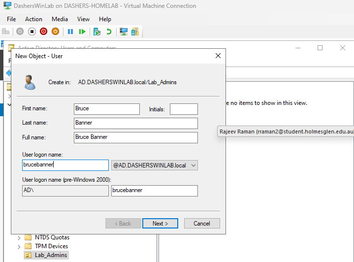 

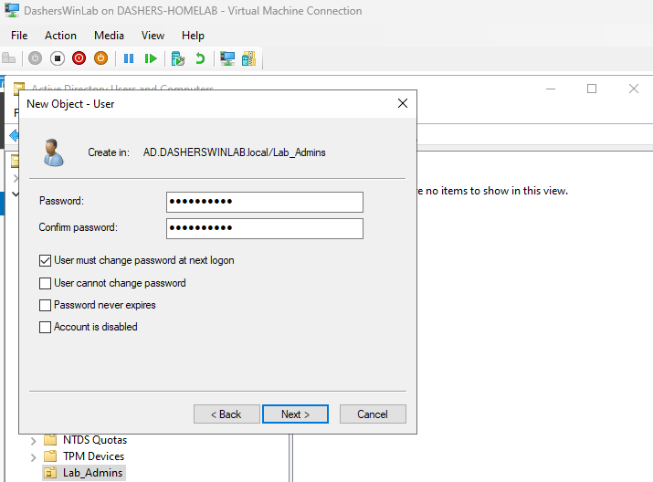 

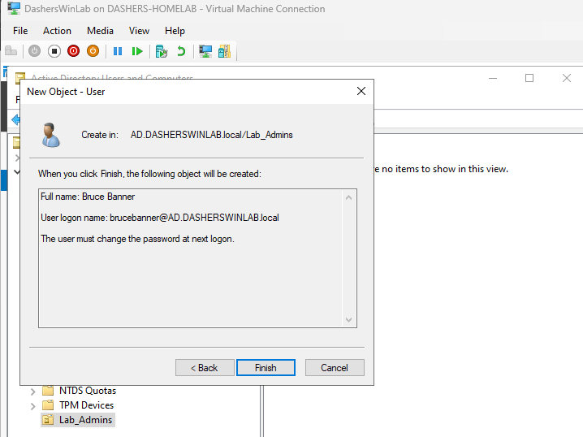 

3. **Assign User to Groups** (Optional):
   - On the **Member Of** tab, add the user to appropriate groups like `Domain Admins`, `Administrators`, or other relevant groups based on administrative roles.

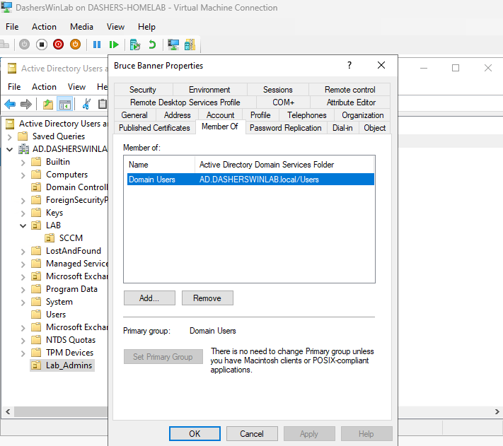 

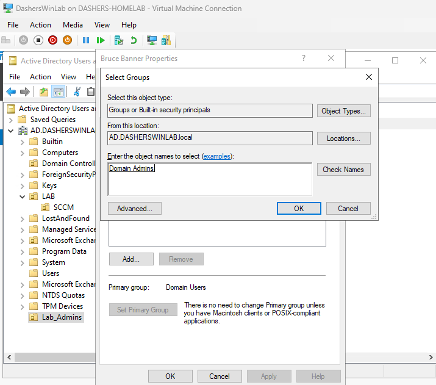 

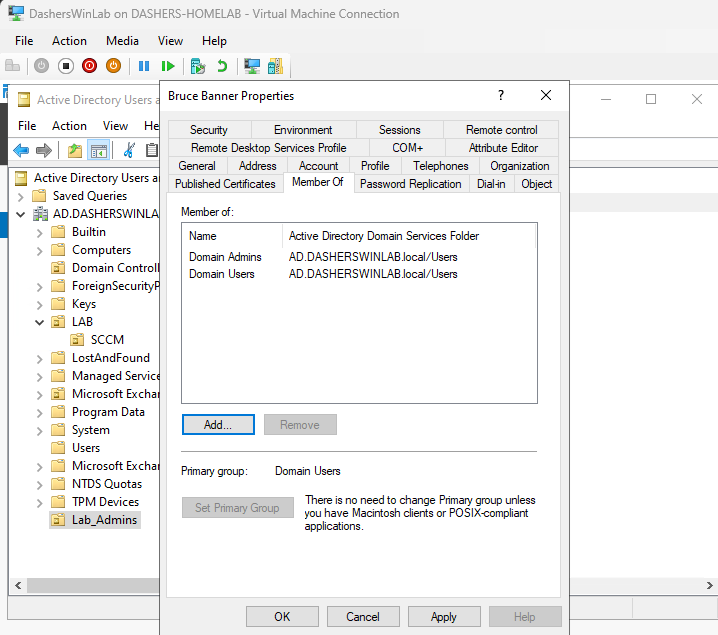 

4. **Configure User Properties**:
   - Customize settings in other tabs as needed, such as **Account**, **Profile**, **Telephones**, etc.

5. **Finish**:
   - Click **OK** to create the user.

### Naming Conventions:

- **OU Naming Convention**: Choose a clear and descriptive name that reflects the purpose of the OU, such as `AdminUsers` for administrative users or `SalesUsers` for sales department users.
- **User Naming Convention**: Typically, usernames should follow a standard format for consistency and clarity. For example, `firstname.lastname` or `firstinitial.lastname` (`bruce.banner` or `bbanner`). I'll stick with my convention 'FirstnameLastname' (example the user: `Bruce Banner` email has `brucebanner@`.

### Example:

- **OU Name**: `LabAdmin`
- **First name: `Bruce`
- Last name: `Banner`
- **User Name**: `brucebanner`

- Restart the PC and on the login page you should have Other User option. select it.

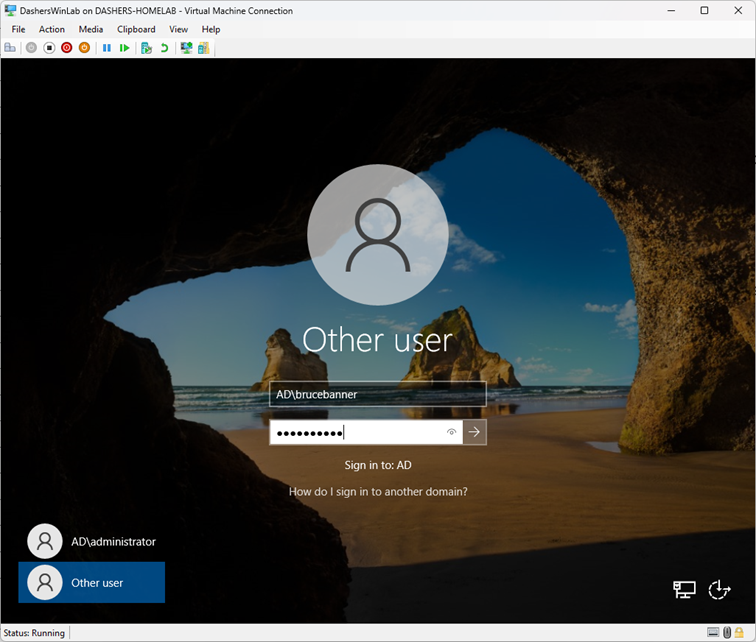 

- Enter the New Administrator credentials and sign in to the Domain.
- Use the format Domainname\username ` AD\brucebanner`
- Since we had checked the box saying password must be changed on first login, it should prompt us for change.

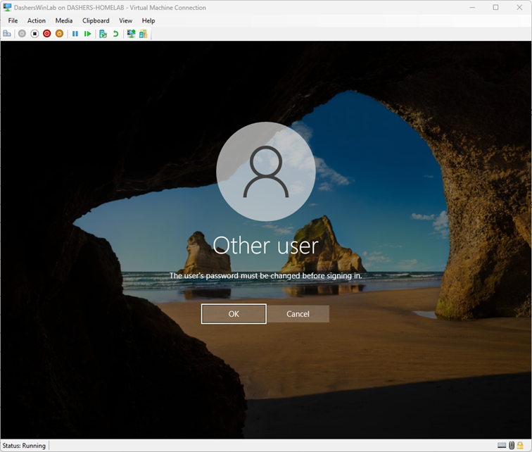 

- Click om OK and enter the current password followed by the new password.
- It will confirm the password chang. Click ok and it should log you in.

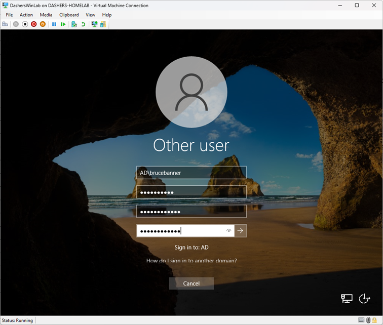 

 

- confirm the login account

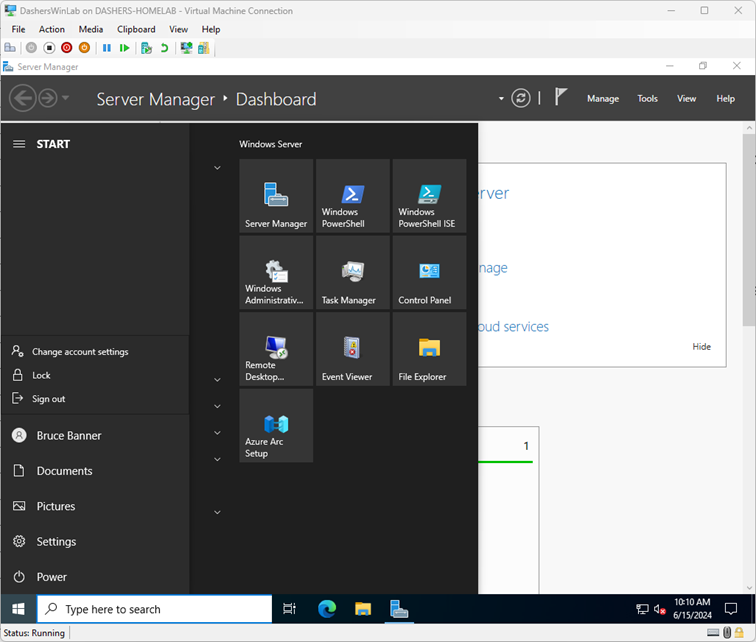 

It is always a better practice to use a normal user or Admin other than the built in Admins.

